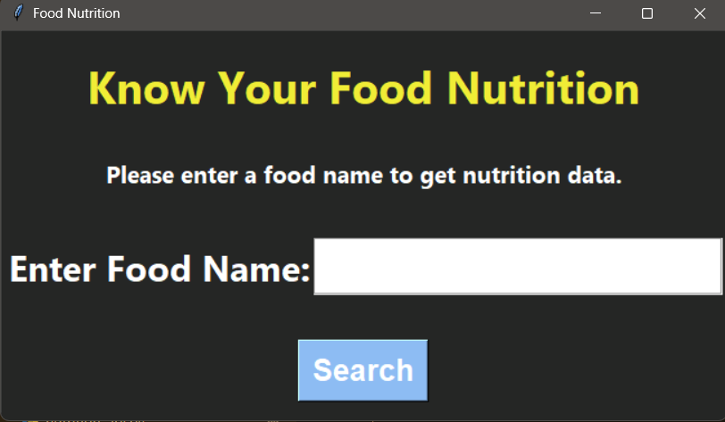
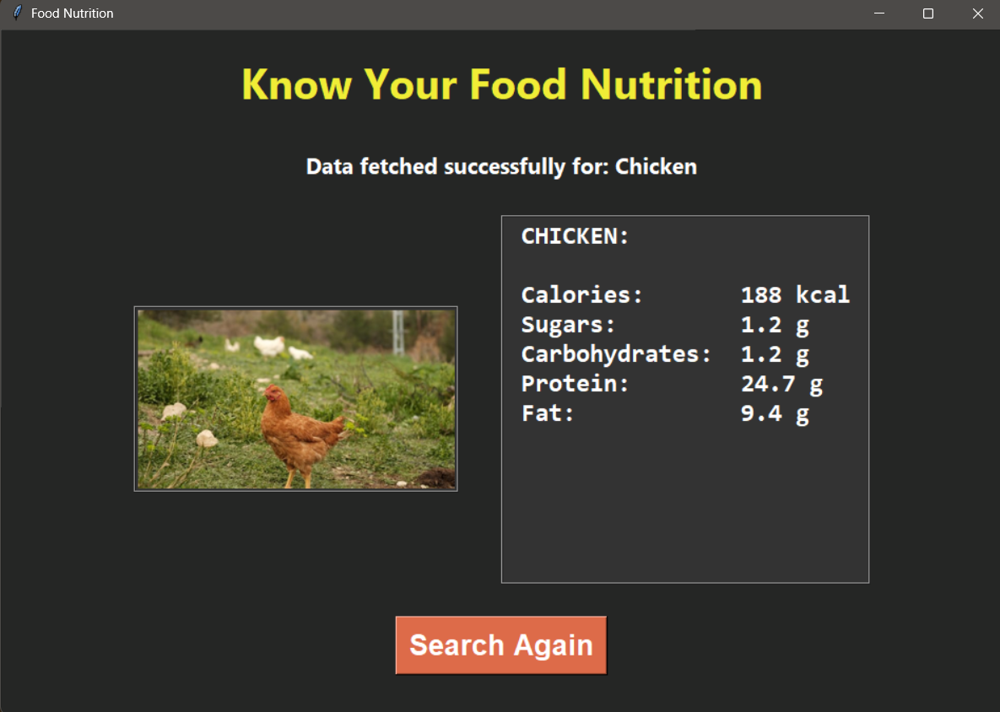

# Food Nutrition Search App

A Tkinter-based desktop application that fetches:

- Nutrition data from USDA FoodData Central API
- Food images from Pexels API

## Features

- Search nutrition information for foods
- Fetch food images using Pexels API
- Display calories, carbohydrates, protein, fat, and sugar
- Tkinter desktop interface

## Tech Stack

- Python
- Tkinter
- Requests
- Pillow
- USDA API
- Pexels API

## Screenshots

## Home Screen

## Nutrition Results

## Setup

pip install -r requirements.txt

Create a .env file:

API_KEY=your_usda_key
PIXABY_API_KEY=your_pexels_key

python main.py